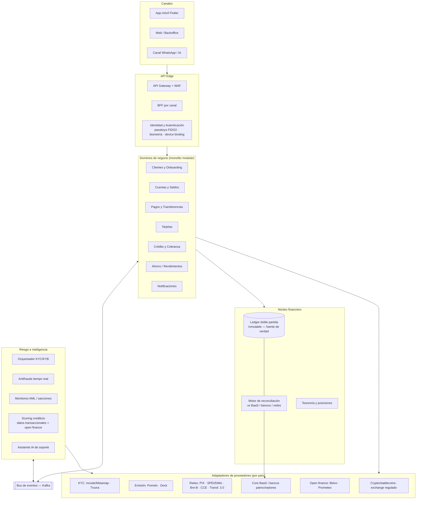

# 05 — Arquitectura de la plataforma tecnológica

> Documento del proyecto **AIBank**. Define la arquitectura de referencia que soporta el catálogo de productos ([doc 03](03-servicios-productos.md)) en ambas rutas regulatorias ([doc 02](02-regulacion-licencias.md)), con capacidad multi-país.

---

## 1. Principios de arquitectura

1. **Monolito modular primero, microservicios al escalar** — el patrón validado por la industria; Nubank llegó a 4.000 microservicios, pero nadie empieza ahí ([InfoQ/Nubank](https://www.infoq.com/presentations/nubank-architectural-decisions/)).
2. **El ledger de doble partida inmutable es la fuente de verdad** — append-only, nunca se edita un asiento; los saldos son proyecciones de eventos. Aun operando sobre BaaS, AIBank mantiene **su propio ledger espejo y reconciliación diaria** (lección Synapse — [Banking Dive](https://www.bankingdive.com/news/5-lessons-learned-from-synapses-collapse/731543/)).
3. **Event-driven** — los dominios (pagos, tarjetas, riesgo, notificaciones) se desacoplan con un bus de eventos (Kafka); permite auditoría, reprocesamiento y analítica en tiempo real.
4. **Abstracción de proveedores ("puertos y adaptadores")** — cada capacidad externa (KYC, emisión de tarjetas, riel de pagos, core BaaS) queda detrás de una interfaz propia. Es lo que permite: cambiar de BaaS a licencia propia, operar rieles distintos por país, y sobrevivir a la caída de un proveedor.
5. **Multi-país por diseño** — aislamiento por país de datos, cumplimiento y moneda; lógica de producto compartida (la arquitectura hexagonal le permitió a Nubank reusar su core en Brasil/México/Colombia).
6. **Seguridad y cumplimiento como código** — PCI fuera de alcance por tokenización, cifrado en reposo y tránsito, auditoría inmutable de todo.

---

## 2. Diagrama de referencia

---

## 3. Decisiones estructurales

### 3.1 Core banking / ledger — decisión build vs buy

| Opción | Cuándo | Costo aprox. |
|---|---|---|
| **BaaS provee el core** (Fase 1) | MVP: cuentas y movimientos viven en el BaaS; AIBank mantiene ledger espejo | Incluido en fees BaaS |
| **Core SaaS** (Pismo, Mambu, Temenos) | Al obtener licencia propia con presupuesto | SaaS mid-market desde ~€8–10K/mes; Temenos promedio ~USD 518K/año ([SDK.finance](https://sdk.finance/blog/how-much-does-temenos-core-banking-software-cost/)) |
| **Open source** (Apache Fineract, Midaz) | Licencia propia con presupuesto ajustado y equipo fuerte | Infra + equipo |
| **Ledger propio** (TigerBeetle como motor contable: 100K–500K TPS — [docs.tigerbeetle.com](https://docs.tigerbeetle.com/single-page/)) | Cuando el volumen y la diferenciación lo justifiquen | Núcleo de ingeniería propio; un core completo custom cuesta USD 15–25M+ y 24–36 meses ([Decta](https://www.decta.com/company/media/build-vs-buy-core-banking-system-decisions-for-neobank-founders)) |

**Decisión AIBank** (cerrada y detallada en el [doc 08](08-plan-de-construccion.md)):
- **Construimos un "core delgado" propio desde el día 1** — ledger de doble partida, cuentas, catálogo de productos y motor de posting sobre PostgreSQL — que es la **fuente de verdad operativa** de toda la plataforma. El BaaS de Fase 1 queda relegado a *conectividad regulada* (custodia legal de fondos, tarjetas, riel) detrás de adaptadores, reconciliado diariamente contra nuestro core.
- **Fase 2 (licencia propia)**: nuestro core pasa a ser también el registro legal — sin migración, porque ya era el operativo. TigerBeetle entra como motor de asientos si el volumen lo exige; Pismo/Mambu quedan solo como plan B si el regulador o la escala exigieran un core certificado comercial.

### 3.2 Capa de abstracción de rieles de pago

Cada país tiene su riel (PIX, SPEI/DiMo, Bre-B, CCE/Yape-Plin, Transferencias 3.0/CVU). El dominio `Pagos` define operaciones canónicas (`iniciar_transferencia`, `resolver_alias`, `recibir_webhook_acreditación`, `devolver`) y cada riel es un adaptador. Reglas:
- Idempotencia por clave de operación en todos los adaptadores (los rieles reintentan webhooks).
- Toda operación de riel emite eventos al bus y asientos al ledger (pendiente → liquidado → conciliado).
- La conciliación por riel corre diaria (o intradía) contra los extractos del proveedor.

### 3.3 Onboarding y KYC

Orquestador propio de pasos (documento → biometría/liveness → validación en fuentes gubernamentales → screening de sanciones → decisión) con proveedores intercambiables por país (Incode/Metamap con la integración gubernamental más profunda en LatAm; Truora en MX/CO/BR/CL/PE — [Signzy](https://www.signzy.com/blogs/best-kyc-verification-platforms-mexico)). **Liveness y device binding obligatorios**: hasta 80% del fraude de cuenta nueva ya usa identidades sintéticas generadas con IA ([ShadowDragon](https://shadowdragon.io/resources/best-fraud-detection-software-tools/)).

### 3.4 Riesgo: antifraude, AML y scoring

- **Antifraude transaccional en tiempo real** desde el MVP: señal de dispositivo + comportamiento + reglas, con proveedor tipo Sardine/Unit21 y camino a modelos propios.
- **AML**: screening de listas (OFAC/ONU/locales) en onboarding y por transacción; motor de alertas y gestión de reportes (ROS/SAR) para el oficial de cumplimiento.
- **Scoring crediticio**: activo diferencial de la casa — se construye propio desde el día 1 acumulando features transaccionales (aunque el crédito se encienda en Fase 2), enriquecido con open finance donde exista (Belvo).

### 3.5 Multi-país y residencia de datos

- **Aislamiento por país**: base de datos y claves de cifrado por país; el cumplimiento (reportes, retención, protección de datos) se configura por jurisdicción.
- **Cloud**: AWS como primario (dominante en fintech LatAm; guías de cumplimiento por regulador — [AWS Compliance Center MX](https://aws.amazon.com/financial-services/security-compliance/compliance-center/mx)). Atención regulatoria: **México exige autorización previa de la CNBV para cloud provisto desde el extranjero** ([Baker McKenzie](https://resourcehub.bakermckenzie.com/en/resources/cloud-compliance-center/na/mexico/topics/regulated-cloud-outsourcing)); **Brasil** impone requisitos de auditoría/notificación al BACEN (Res. CMN 4.893) ([GCP/BCB](https://cloud.google.com/security/compliance/bcb-brazil)).

### 3.6 IA integrada (no adosada)

| Caso de uso | Fase | Referencia |
|---|---|---|
| Asistente de soporte conversacional (resolución N1 + copiloto de agentes) | MVP | Nubank resuelve 55% de N1, −70% tiempos de respuesta ([OpenAI](https://openai.com/index/nubank/)) |
| Scoring alternativo sobre comportamiento transaccional | Fase 2 | UaláScore; Nubank compró Hyperplane para modelos propios |
| Antifraude con ML en tiempo real | MVP (vía proveedor) → propio | Sardine/Feedzai |
| Asesor financiero personal (insights de gasto, metas) | Fase 3 | Tendencia 2026: 82% de bancos brasileños ya usan GenAI ([Vorantis](https://vorantis.co/blog/ai-use-cases-banking-latam)) |

---

## 4. Seguridad y cumplimiento técnico

| Área | Estándar / medida |
|---|---|
| **PCI DSS v4.0.1** | Vigente al 100% desde 31-mar-2025 ([Thales](https://cpl.thalesgroup.com/blog/encryption/pci-dss-4-0-compliance-2025)). Estrategia: **tokenizar con el emisor/procesador (Pomelo/Dock son PCI Level 1) para reducir el CDE propio a ~cero** — la app nunca ve PANs completos |
| **Certificaciones** | ISO 27001 + SOC 2 Type II (estándar de facto para partners bancarios); pentest externo anual + programa de bug bounty |
| **Cifrado** | TLS 1.3 en tránsito; AES-256 en reposo; claves en KMS/HSM (FIPS 140-2/3); tokenización de PII; secretos en Vault/Secrets Manager |
| **Autenticación de clientes** | Passkeys FIDO2 device-bound + biometría + device binding; step-up para operaciones de alto riesgo ([Wultra](https://www.wultra.com/blog/passwordless-authentication-in-banking-a-guide-to-fido2-passkeys)) |
| **Auditoría** | Log inmutable de toda acción (cliente y backoffice); trazas distribuidas (OpenTelemetry) — críticas para conciliar pagos asíncronos |
| **Regulatorio local** | CUB/CNBV (MX, reporte de incidentes 72 h desde 2026), Res. 4.893/BCB 85 (BR), circulares SFC (CO), NCG 502/541 (CL) |
| **Resiliencia** | Multi-AZ, RTO < 1 h / RPO ≈ 0 para el ledger; game days de caída de proveedores (BaaS caído ≠ app caída: modo degradado con consulta de saldo desde el ledger espejo) |

---

## 5. Qué se construye vs qué se compra (resumen)

**Se construye (diferencial):** experiencia de producto (app), orquestador de onboarding, ledger espejo + reconciliación, motor de decisión de riesgo/scoring, capa de adaptadores, backoffice de operaciones y cumplimiento, plataforma de datos.

**Se compra (commodity regulado):** core/cuentas BaaS, emisión y procesamiento de tarjetas, verificación KYC, screening AML, señal antifraude, acceso a rieles, open finance, infraestructura cloud.

El detalle por componente con alternativas está en [doc 06](06-stack-tecnologico.md); las fases de construcción en [doc 07](07-roadmap-desarrollo.md).
