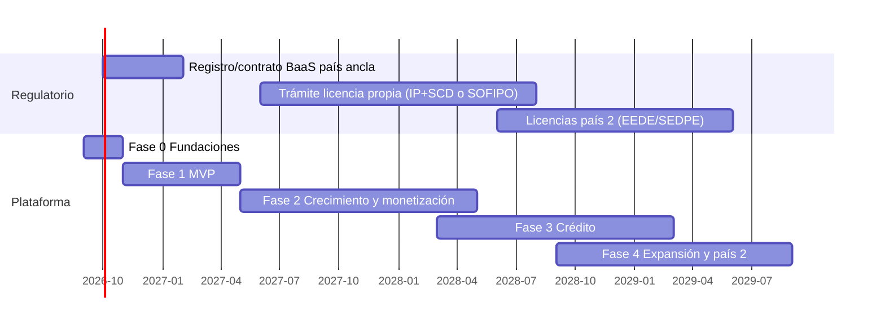

# 07 — Roadmap de desarrollo de la plataforma

> Documento del proyecto **AIBank**. Fases de construcción, equipo, estimaciones y criterios de avance. Consistente con las fases de producto ([doc 03](03-servicios-productos.md)), el plan de negocio ([doc 04](04-plan-negocio.md)) y la arquitectura ([doc 05](05-arquitectura-plataforma.md)).

Benchmarks de referencia: MVP de neobanco sobre proveedores = **USD 150–400K y 4–6 meses** de ingeniería; equipo típico 12–20 personas; los costos ocultos (BaaS, KYC ~USD 0,20–1,50 por verificación, pentesting, legal, cloud) suman 15–30% del gasto del año 1 ([Purrweb](https://www.purrweb.com/blog/neobank-development-cost/); [SDK.finance](https://sdk.finance/blog/how-to-build-an-online-bank/); [Designography](https://designography.ca/how-to-build-a-neobank-in-2025-mvp-cost-compliance-launch-plan/)).

---

## Fase 0 — Fundaciones (meses 0–2)

**Objetivo**: decisiones cerradas, cimientos técnicos y regulatorios en marcha.

| Frente | Entregables |
|---|---|
| Regulatorio | País ancla elegido; asesor legal contratado; expediente PSPCP/BaaS iniciado; Compliance Officer contratado |
| Proveedores | Contratos firmados: BaaS/emisor (Pomelo o equivalente), KYC, antifraude; sandbox habilitados |
| Plataforma | Monorepo, CI/CD, IaC (Terraform+EKS), entornos dev/staging, observabilidad base, gestión de secretos |
| Núcleo | **Esquema del ledger de doble partida** (append-only) + primeras pruebas de propiedad contable (invariantes: débitos=créditos, no edición) |
| Producto | Design system, prototipo de onboarding validado con usuarios |

**Equipo**: 8–12 (CTO, 4–6 backend, 2 mobile, 1 SRE, 1 diseño, compliance).
**Gate de salida**: sandbox del BaaS operando cuenta+transferencia de prueba; ledger espejo registrando esas operaciones.

## Fase 1 — MVP (meses 2–8)

**Objetivo**: lanzar al público el producto de la Fase 1 del catálogo (cuenta + riel local + tarjeta + servicios).

Orden de construcción (cada bloque termina integrado, probado y monitoreado):

1. **Onboarding + KYC** (mes 2–4): orquestador propio, biometría/liveness, screening de sanciones, device binding, alta de cuenta en BaaS + espejo en ledger.
2. **Cuenta y movimientos** (mes 3–5): saldos como proyección del ledger, home de la app, notificaciones push en tiempo real.
3. **Pagos por riel local** (mes 4–6): adaptador del riel (idempotencia, webhooks, devoluciones), P2P por alias/QR, **motor de reconciliación diaria** contra el BaaS.
4. **Tarjeta** (mes 5–7): emisión virtual instantánea + física, congelar/CVV dinámico/límites, webhooks de autorización con reglas antifraude en línea.
5. **Servicios y recargas + asistente IA de soporte** (mes 6–8).
6. **Hardening pre-lanzamiento** (mes 7–8): pentest externo, pruebas de carga, game day de caída del BaaS (modo degradado), revisión de cumplimiento, beta cerrada (500–2.000 usuarios) → lanzamiento.

**Equipo**: 12–20. **Costo estimado de la fase**: USD 500–900K all-in (nómina + proveedores + cloud + legal), consistente con el rango investigado más margen para LatAm senior.
**Gate de salida (encender crecimiento)**: crash-free > 99,8%; reconciliación con diferencias = 0 explicadas; fraude < 15 bps de TPV; NPS beta > 55.

## Fase 2 — Crecimiento y monetización (meses 8–20)

**Objetivo**: escalar usuarios, encender ingresos, preparar la licencia propia.

| Bloque | Contenido |
|---|---|
| Growth | Motor de referidos, deep links del riel local, analítica de funnel completa, experimentación (feature flags) |
| Cuenta remunerada | Integración money market / rendimiento sobre saldo (según marco del país); "cajitas"/metas |
| Cobro a comercios | QR de cobro, link de pago, mini-dashboard comercio |
| **Plataforma de datos** | Lakehouse + dbt + feature store: acumular 12+ meses de features transaccionales para el scoring (prerequisito del crédito) |
| Suscripción premium | Tier de pago con beneficios |
| **Trámite de licencia propia** (paralelo, no bloqueante) | Expediente IP+SCD (Brasil) o compra de SOFIPO (México) según decisión T1 del [doc 04 §3](04-plan-negocio.md) |
| Escalamiento técnico | Extraer a servicio los dominios calientes (pagos, auth) solo si las métricas lo piden; SLOs formales; segundo proveedor KYC |

**Equipo**: 25–40 (+datos/riesgo, growth, más backend).
**Gate de salida (encender crédito)**: los criterios go/no-go del [doc 04 §9](04-plan-negocio.md) — MAU > 35%, CAC < USD 8, 12+ meses de datos, y capacidad legal de prestar (licencia propia aprobada o socio prestamista).

## Fase 3 — Crédito (meses 18–30)

**Objetivo**: el motor de ingresos #1 en producción, con riesgo controlado.

1. **Motor de decisión crediticia**: scoring propio (features transaccionales + open finance vía Belvo + buró como complemento); política conservadora inicial — límites bajos con buildup, priorizar clientes con nómina/depósito recurrente (patrón C6: 80% colateralizado).
2. **Tarjeta de crédito**: ciclo completo — autorización, corte, estado de cuenta, pagos, intereses, mora.
3. **Préstamos personales pre-aprobados**: originación in-app, desembolso al instante por el riel.
4. **Cobranza**: recordatorios, reestructuración in-app, agencias como último recurso.
5. **Tesorería y fondeo**: gestión de capital para prestar (equity → deuda local → depósitos si hay licencia de captación).
6. **Migración BaaS → core propio/SaaS** si se cumplió la regla de transición (>100–300K usuarios, costo BaaS > USD 1–2M/año): migración por cohortes con doble contabilidad temporal, el ledger espejo pasa a ser fuente primaria.

**Equipo**: 40–60 (+equipo de crédito/riesgo y cobranza).
**Gate de salida**: NPL 90+ < 7% con cosechas estables; ARPAC > USD 4/mes; unit economics de crédito positivos por cosecha.

## Fase 4 — Expansión (meses 30+)

- Portafolio: remesas (rieles stablecoin), inversiones, crypto, seguros, BNPL — según tracción ([doc 03 Fase 3](03-servicios-productos.md)).
- **Segundo país**: activar el aislamiento multi-país del [doc 05 §3.5](05-arquitectura-plataforma.md) — nueva jurisdicción = nueva configuración de cumplimiento + adaptadores locales (riel, KYC), no un fork del producto. Licencias ligeras (EEDE Perú ~USD 0,8M; SEDPE Colombia ~USD 2M) o BaaS local.
- PYMES: cuenta empresa, adquirencia, capital de trabajo.

---

## Calendario resumido

*(Fechas ilustrativas asumiendo arranque en septiembre de 2026; lo vinculante son las duraciones y las dependencias.)*

---

## Presupuesto tecnológico orientativo (acumulado)

| Hito | Acumulado (USD) | Incluye |
|---|---|---|
| MVP lanzado (mes 8) | 0,8–1,5M | Equipo, proveedores, cloud, legal, pentest |
| 100K usuarios (mes ~18) | 3–6M | Growth, datos, licencia en trámite |
| Crédito en producción (mes ~30) | 10–20M | Capital regulatorio + capital para prestar + equipo 40–60 |

## Riesgos de ejecución del roadmap

| Riesgo | Mitigación en el plan |
|---|---|
| Demora del BaaS/regulador desplaza el lanzamiento | Fase 0 arranca el expediente antes de escribir código de producto; sandbox como criterio de gate |
| Construir crédito sin datos suficientes | La plataforma de datos es entregable de Fase 2, no de Fase 3; gate explícito de 12+ meses de features |
| Migración de core a mitad de crecimiento | Ledger espejo desde Fase 0 + adaptadores hacen la migración un cambio de adaptador, no una reescritura |
| Sobre-ingeniería temprana | Monolito modular obligatorio hasta que las métricas justifiquen extraer servicios |
