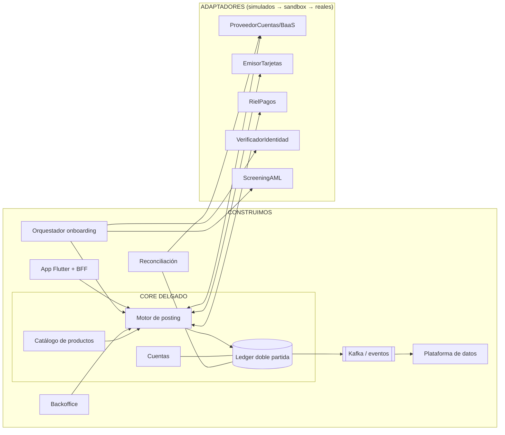

# 08 — Decisión del core y plan de construcción

> Documento del proyecto **AIBank**. Cierra la decisión estructural: **qué construimos, qué alquilamos y qué simulamos mientras contratamos**, y define el core bancario alrededor del cual se construye todo lo demás. Este documento manda sobre las matrices de los docs [05](05-arquitectura-plataforma.md) y [06](06-stack-tecnologico.md) donde haya diferencia.

---

## 1. La decisión: SÍ construimos el core bancario — pero un "core delgado" (thin core)

**Decisión**: AIBank construye su propio core bancario desde el día 1, definido como **core delgado**: la contabilidad, las cuentas, el catálogo de productos y el motor de transacciones. Lo que NO es el core delgado —la conectividad regulada con el mundo exterior (emisión de tarjetas, rieles de pago, verificación de identidad, custodia legal de fondos)— se alquila o se simula.

**Por qué esta es la respuesta correcta a "¿el core se construye o se compra?":**

1. **"Core bancario" son en realidad dos cosas distintas.** (a) El *sistema de registro*: quién tiene cuánto, qué movimientos hubo, qué productos existen — eso es software de contabilidad y reglas, barato de construir bien a pequeña escala. (b) La *conectividad regulada*: BIN de Visa/Mastercard, acceso al riel de pagos, custodia legal de los fondos — eso NO es software que puedas construir: son licencias, membresías y certificaciones que cuestan años y millones. Los vendors de core (Pismo, Mambu, Temenos) te venden (a) con integraciones a (b). Nosotros construimos (a) y alquilamos (b).
2. **El sistema de registro es exactamente donde no queremos depender de terceros.** Es la fuente de toda la analítica, el scoring, la reconciliación y la confianza contable (lección Synapse). Es también lo que Revolut construyó propio y señala como la razón de su velocidad.
3. **Es viable con presupuesto de arranque.** Un core delgado bien diseñado (PostgreSQL, doble partida, append-only) es un proyecto de semanas-persona, no de años. Lo caro de los cores comerciales es la conectividad, el cumplimiento multi-jurisdicción y la escala — nada de eso lo necesitamos dentro del core el día 1.
4. **Evita la peor migración de la historia del proyecto.** Si lanzamos con el core del BaaS como fuente de verdad y luego queremos independencia, hay que migrar el sistema de registro con clientes vivos. Si nuestro core es la fuente de verdad operativa desde el día 1, cambiar de BaaS —o pasar a licencia propia— es cambiar adaptadores de conectividad, no mudar la contabilidad.

**Matiz legal importante**: mientras operemos sobre BaaS, los fondos están legalmente custodiados por el proveedor licenciado y su registro es el que vale ante el regulador. Nuestro core es la **fuente de verdad operativa** (lo que la app muestra, lo que alimenta riesgo y analítica) y se **reconcilia diariamente** contra el registro del BaaS. Cualquier discrepancia es un incidente de máxima prioridad. Al obtener licencia propia, nuestro core pasa a ser también el registro legal — sin migración, porque ya era el operativo.

---

## 2. Definición del core delgado: módulos exactos

Estos módulos son EL centro; todo lo demás se construye alrededor:

| Módulo | Responsabilidad | Reglas duras |
|---|---|---|
| **Ledger** | Libro de doble partida, append-only. Toda mutación de dinero es una *transacción contable* con 2+ asientos que suman cero | Nunca UPDATE/DELETE de asientos; correcciones = asientos de reversa; invariante `Σ débitos = Σ créditos` verificada por constraint y por job continuo |
| **Cuentas** | Cuentas de clientes y cuentas internas (fees, tránsito/settlement, posiciones con proveedores, impuestos) sobre un plan contable | Toda cuenta pertenece al plan contable; los saldos son proyecciones del ledger, jamás un campo editable |
| **Catálogo de productos** | Definición de productos (cuenta simple, cuenta remunerada, tarjeta, futuro crédito) como configuración: límites, comisiones, reglas de intereses | Producto nuevo = configuración + asientos nuevos, no un fork del código |
| **Motor de posting (transacciones)** | API interna única por la que entra TODO movimiento: valida, aplica reglas del producto, escribe en el ledger de forma atómica | **Idempotencia por clave de operación** (los rieles y webhooks reintentan); estados explícitos: `pending → posted → settled / reversed`; nada escribe al ledger sin pasar por aquí |
| **Contrapartes externas** | Representación contable de cada proveedor (BaaS, emisor, riel) como cuentas espejo/settlement | Base del motor de reconciliación |

Lo que queda **explícitamente fuera** del core delgado (y por eso se puede alquilar/simular): verificación de identidad, procesamiento de tarjetas, mensajería con rieles, notificaciones, backoffice, app. Todos hablan con el core a través del motor de posting y del bus de eventos.

---

## 3. Tabla definitiva: CONSTRUIR / ALQUILAR / SIMULAR

**Simular** = construir ya el adaptador contra nuestra propia interfaz con una implementación fake (y luego sandbox del proveedor), para avanzar la construcción sin esperar contratos. Al firmar, se enchufa la implementación real; el resto del sistema no se entera.

### CONSTRUIR (nuestro, desde el día 1)

| Componente | Nota |
|---|---|
| **Core delgado** (ledger, cuentas, catálogo, posting engine) | §2. El centro de todo |
| **Motor de reconciliación** | Compara ledger propio vs extractos del proveedor, diario; diferencias = alerta crítica |
| **Capa de adaptadores (puertos)** | Interfaces propias: `ProveedorCuentas`, `EmisorTarjetas`, `RielPagos`, `VerificadorIdentidad`, `ScreeningAML`, `Notificador` |
| **Orquestador de onboarding** | Flujo propio de alta (pasos, reintentos, decisión); llama al verificador vía puerto |
| **App móvil (Flutter) + BFF** | La experiencia es nuestra |
| **Backoffice** | Operaciones, cumplimiento, gestión de casos; auditoría total |
| **Bus de eventos + plataforma de datos** | Kafka + esquema de eventos propio; cada movimiento alimenta NUESTRO historial (futuro scoring) |
| **Asistente IA de soporte** | Sobre Claude API con RAG + acciones; con escalamiento humano (anti-lección Revolut) |

### ALQUILAR (con adaptador + cláusula de salida + exportación de datos)

| Componente | Proveedor objetivo | Por qué no se construye |
|---|---|---|
| Custodia de fondos / licencia (Fase 1) | BaaS (Pomelo o equivalente) / registro PSPCP propio según país | Es regulatorio, no software; peldaño 1 de la escalera ([doc 06 §4](06-stack-tecnologico.md)) |
| Emisión y procesamiento de tarjetas | Pomelo / Dock | BIN, certificación de red y PCI Level 1 — años y millones |
| Verificación de identidad (KYC) | Incode/Metamap o Truora | Integraciones gubernamentales por país; commodity intercambiable |
| Screening de sanciones/AML | Sumsub / ComplyAdvantage | Listas y actualización continua; commodity regulado |
| Señal antifraude transaccional | Sardine o equivalente | Red de señales entre clientes que un jugador solo no tiene; nuestras reglas van encima |
| Infraestructura cloud | AWS | Kubernetes+Terraform mantienen el lock-in bajo |
| Mensajería (push/SMS/WhatsApp) | Twilio/Meta BSP | Commodity puro |

### SIMULAR AHORA, contratar en paralelo

| Adaptador | Implementación fake (sprint 1–2) | Se reemplaza por |
|---|---|---|
| `ProveedorCuentas` (BaaS) | In-memory/DB local que confirma altas y movimientos al instante | Sandbox del BaaS → producción |
| `RielPagos` | Simulador de riel: acredita transferencias con latencia y reintentos configurables (incluye duplicados y fuera-de-orden para probar idempotencia) | Riel vía BaaS → riel directo con licencia propia |
| `EmisorTarjetas` | Emite tarjetas fake y envía webhooks de autorización sintéticos | Sandbox Pomelo/Dock |
| `VerificadorIdentidad` | Aprueba/rechaza según reglas de test (documentos mágicos) | Sandbox del proveedor KYC |
| `ScreeningAML` | Lista de sanciones de juguete | Proveedor real |
| `Notificador` | Log/console | Twilio/BSP |

**Consecuencia poderosa**: con los simuladores, el equipo puede construir y probar de punta a punta (alta → cuenta → transferencia → tarjeta → reconciliación) **desde la semana 1, sin ningún contrato firmado**. Los contratos corren en paralelo sin bloquear ingeniería — y el simulador de riel se queda para siempre como herramienta de tests.

---

## 4. Cómo se construye el resto alrededor del core



Regla de dependencia: **los adaptadores dependen del core; el core no sabe qué proveedor hay detrás de cada puerto.**

---

## 5. Backlog inicial de construcción (primeros ~3 meses)

Estructura de monorepo propuesta:

Políglota por tarea (justificación en [doc 06 §2](06-stack-tecnologico.md)):

```
aibank/
├── core/            # RUST — ledger, cuentas, catálogo, posting (sin SDKs de proveedores)
├── adapters/        # GO — un servicio por puerto: baas/, cards/, rails/, kyc/, aml/, notify/
│   └── */sim/       #      implementación simulada de cada puerto
├── services/        # GO — onboarding, reconciliación, notificaciones
├── bff/             # GO — API para la app
├── risk/            # PYTHON — scoring, antifraude, modelos (Fase 2)
├── app/             # DART/FLUTTER
├── backoffice/      # TYPESCRIPT/REACT
├── contracts/       # Protobuf/OpenAPI — contratos tipados entre lenguajes
├── platform/        # infra: terraform/, k8s/, docker-compose, observabilidad
└── docs/            # este plan
```

| Sprint (2 sem) | Entregable | Criterio de aceptación |
|---|---|---|
| **1** | Monorepo + CI + entorno local (docker-compose: PostgreSQL, Kafka). **Esquema del ledger** + motor de posting v1 | Invariantes probadas: doble partida suma cero, append-only, idempotencia bajo reintentos concurrentes (test de estrés) |
| **2** | Cuentas + catálogo v1 (producto "cuenta simple") + simuladores `ProveedorCuentas` y `RielPagos` | Alta de cuenta y transferencia E2E contra simuladores; eventos en Kafka |
| **3** | Orquestador de onboarding + simulador KYC + BFF v1 | Flujo alta completo por API; estados y reintentos correctos |
| **4** | App Flutter v0 (alta, saldo, movimientos, transferir) contra BFF | Demo E2E en dispositivo real con simuladores |
| **5** | Adaptador tarjetas (simulado) + webhooks de autorización + **motor de reconciliación v1** | Autorización de compra refleja asiento correcto; reconciliación detecta una discrepancia inyectada |
| **6** | Backoffice v0 (consulta de clientes/movimientos, casos) + observabilidad (trazas E2E) + hardening | Una transferencia se puede seguir por trace desde la app hasta el asiento |

En paralelo (no bloqueante): negociación BaaS/KYC, expediente regulatorio del país ancla (Fase 0 del [doc 07](07-roadmap-desarrollo.md)). **Al firmar el BaaS**, sprints 7+ reemplazan simuladores por sandbox y preparan la beta.

---

## 6. Criterios de calidad del core (no negociables)

1. **Cero pérdida contable**: propiedad verificada por tests — cualquier secuencia de operaciones (incluidos reintentos, duplicados y caídas a mitad) deja el ledger balanceado.
2. **Idempotencia demostrada**: el mismo webhook/orden aplicado N veces = 1 solo efecto.
3. **Auditoría completa**: de cada saldo se puede reconstruir el porqué (lista de asientos) sin herramientas especiales.
4. **El core no importa código de proveedores**: `core/` no compila con SDKs de terceros; solo puertos propios.
5. **Reconciliación desde el primer día con proveedor real**: si la reconciliación no está lista, no se conecta producción.
